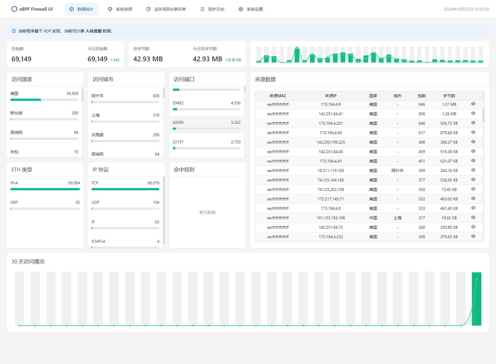
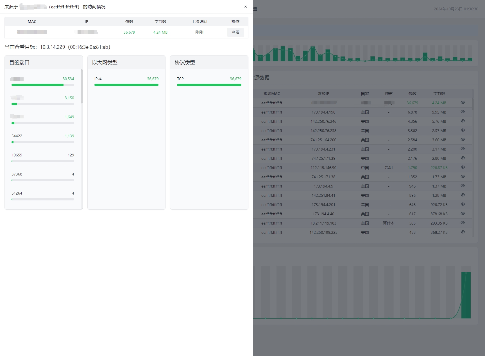
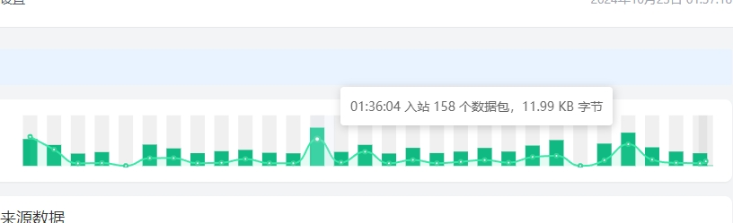

# eBPF Firewall

eBPF Firewall 是基于 eBPF 技术的高性能网络防火墙系统，具有实时入站流量监控、规则过滤和黑名单管理等功能。主要用于在资源有限的 VPS 中进行入站流量监控和过滤。

## 功能特点

- 基于 eBPF XDP 实现高性能数据包处理
- 基于三层网络的 IP、MAC 地址的黑名单管理
- 实时流量监控和统计
- 灵活的规则配置和过滤
- 直观的 Web 用户界面
- 极少的资源使用
- 支持威胁情报集成

## 更新日志

- 2024-11-03

  - 重构整体架构
  - 支持自动下载 GeoLite2-City
  - 新增基于文件的持久化
    > 测试过多种方案（sqlite、postgresql、tdengine、k/v db...），要么运行一段时间后资源占用太多，要么性能不行，要么不方便统计查询，最后还是决定基于 json 文件
  - 新增支持 IP、Cidr、MAC 匹配
  - 新增"威胁情报"模块

    > 目前仅支持 [AbuseIPDB](https://www.abuseipdb.com/) 、 [Spamhaus](https://www.spamhaus.org/)。支持自动更新

    > 最终设计在 User Space 中运行，在 Kernel Space 中需要考虑兼容性问题，低版本内核支持的 eBPF 指令有限，要兼容代码量太大

  - 新增 ElasticPool 支持自动扩缩容，避免因突增流量导致任务积压
  - 新增 auth 配置，增强在公网的安全性
  - 重构前后端通讯模式，改为使用 Restful API
  - 新增 docker 镜像发布
  - 新增 quickstart.sh 脚本，简化编译、运行流程
    > ps. 要到年底就开始忙....前端规则配置部分还没时间弄，前端也不是我强项，设计界面比写算法都累，暂时放一放，头疼

## 截图







## 技术栈

- eBPF: C
- 后端: Go
- 前端: React, TypeScript, Tailwind CSS
- 数据可视化: ECharts

## 编译 & 运行

- 克隆仓库

```bash
git clone https://github.com/danger-dream/ebpf-firewall.git
cd ebpf-firewall
```

- 编译 docker 镜像

```bash
chmod +x quickstart.sh
./quickstart.sh build
```

- 运行

```bash
./quickstart.sh start
```

### Quickstart

项目提供了 `quickstart.sh` 用于自动化部署和管理，支持完整的容器生命周期管理。

#### 基础部署

```bash
# Build docker image
./quickstart.sh build

# Deploy container
./quickstart.sh start

# Build and deploy in one command
./quickstart.sh run
```

#### 生产环境配置

```bash
# Specify network interface and listening address
./quickstart.sh start \
    -i eth0 \
    --addr 0.0.0.0:8080 \
    -a ${YOUR_AUTH_TOKEN} \
    -d /data/ebpf-firewall

# Deploy with custom image tag
./quickstart.sh run \
    --tag v1.0.0 \
    --no-cache \
    -i eth0
```

#### 运维管理

```bash
# View real-time logs
./quickstart.sh logs -f --tail 100

# Stop service
./quickstart.sh stop

# Clean up resources
./quickstart.sh clean

# Prune docker build cache
./quickstart.sh prune
```

#### 具体用法

```bash
# ./quickstart.sh
Usage: ./quickstart.sh <command> [options]

Commands:
    build   Build the container image
    start   Start the container
    stop    Stop the container
    remove  Stop and remove the container
    clean   Remove both container and image
    run     Build image and start container
    prune   Clean up docker build cache
    logs    View container logs

Options:
    -t, --tag <tag>         Specify image tag (default: latest)
    -n, --no-cache          Build without using cache
    -f, --follow            Follow log output
    --tail <n>              Number of lines to show from the end of logs

Runtime Options:
    -i, --interface <name>  Network interface to monitor
    -p, --port <port>       API port (default: 5678)
    --addr <address>        API address (default: :5678)
    -d, --data <path>       Data directory path (default: ./data)
    -a, --auth <token>      API authentication token (default: auto generated)

Examples:
    ./quickstart.sh build --tag v1.0.0
    ./quickstart.sh run -i eth0 -p 8080
    ./quickstart.sh start -i ens33 --addr :18080
    ./quickstart.sh start -i ens33 --addr 10.0.0.10:8080 -a 1234567890
    ./quickstart.sh logs -f
```

## 待开发...

- [x] 数据持久化
- [x] 基于开源的恶意情报库自动阻断流量
- [ ] Web 界面规则配置、黑名单配置
- [ ] 异常消息推送
- [ ] 基于 eBPF 的链路追踪
  > 已经实现，但存储开销太大，不符合项目初衷
- [ ] 流量异常检测
  > 翻了很多论文，也测试了一些方案，但网络环境复杂，很难实现一个小巧且通用的检测模型。考虑有空的话得重构一个不考虑资源限制、也不考虑兼容性的版本。

## 贡献

请查看 [CONTRIBUTING.md](./CONTRIBUTING.md)

## 许可证

本项目采用 MIT 许可证。详见 [LICENSE](LICENSE) 文件。
